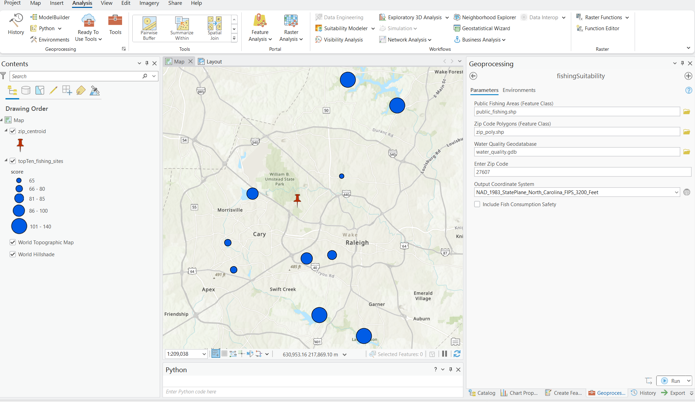
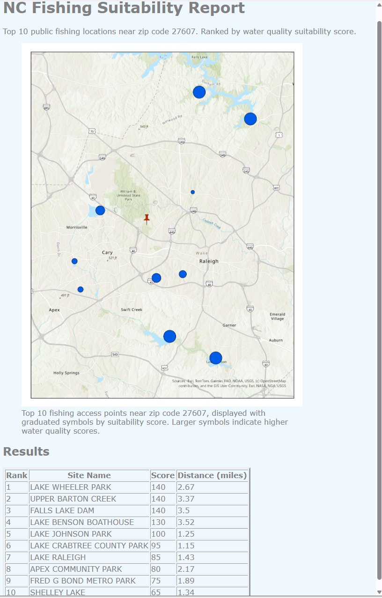

# Freshwater Fishing Suitability

ArcGIS Pro geoprocessing tool that ranks freshwater fishing locations by water quality, proximity, and fish consumption safety,

## Overview

Public fishing access locations are easy to find, but knowing whether a fishing spot is actually suitable or safe to consume fish from is much more challenging. Doing so requires combining water quality assessments, proximity analysis, and, when desired, fish consumption advisories into a single decision-making workflow.

This ArcGIS Pro geoprocessing tool automates that process. Given a user-specified ZIP code, it identifies nearby public fishing access locations and ranks them using a rule-based suitability scoring system based on water quality and proximity. Users can optionally incorporate fish consumption safety criteria, such as mercury and PCB advisories, to identify locations that are not only accessible but also safer for recreational fishing.

This repository demonstrates the workflow using publicly available datasets from North Carolina. However, the tool is designed to be reusable and can be adapted for other states or regions by substituting equivalent public fishing access, water quality, and ZIP code datasets.

## Key Features

- Interactive ArcGIS Pro geoprocessing tool with a user-friendly interface
- Accepts a user-specified ZIP code to identify nearby public fishing locations
- Integrates public fishing access locations with EPA water quality assessments
- Uses a rule-based suitability scoring system to rank fishing locations
- Optional fish consumption safety analysis incorporating mercury and PCB advisories
- Filters to the 10 nearest fishing locations by distance, then ranks them by suitability score
- Generates a ranked feature class for visualization in ArcGIS Pro
- Produces an HTML report summarizing analysis results
- Designed to be reusable with equivalent datasets from other states or regions

## Tool Interface

The Freshwater Fishing Suitability tool is implemented as an ArcGIS Pro geoprocessing script tool. The interface provides a concise set of configurable parameters while supplying sensible defaults for the North Carolina demonstration workflow.

- **Input Datasets:** Default paths point to the North Carolina demonstration datasets and can be replaced with equivalent public fishing access, water quality, and ZIP code datasets from other states or regions.
- **ZIP Code:** Defaults to **27607 (Raleigh, NC)** for demonstration purposes and accepts any valid ZIP code within the study area.
- **Output Coordinate System:** Defaults to **NAD 1983 StatePlane North Carolina FIPS 3200 (Feet)** and can be changed to match the coordinate system of other GIS projects.
- **Fish Consumption Safety:** Disabled by default and can be enabled to incorporate mercury and PCB advisories into the suitability scoring process.



*Figure 1. ArcGIS Pro geoprocessing interface for the Freshwater Fishing Suitability geoprocessing tool.*

## Workflow

The Freshwater Fishing Suitability tool follows the workflow below to identify and rank suitable public fishing locations.

```text
User Input
      │
      ▼
Set up output directories and scratch geodatabase
      │
      ▼
Validate all required input datasets
      │
      ▼
Convert shapefile inputs to geodatabase feature classes to prevent field name truncation
      │
      ▼
Locate the user by calculating the centroid of the selected ZIP code
      │
      ▼
Reproject water quality data to the selected output coordinate system
      │
      ▼
Spatially join each fishing access point to the nearest EPA ATTAINS water quality line feature
      │
      ▼
Calculate suitability scores using water quality attributes
(optionally incorporating fish consumption safety criteria)
      │
      ▼
Calculate distances from the ZIP code centroid
      │
      ▼
Filter to the 10 nearest fishing locations
      │
      ▼
Rank locations by suitability score
      │
      ▼
Generate output feature classes, map visualization, and HTML report
```
## Project Outputs

Running the Freshwater Fishing Suitability tool generates the following outputs:

- **Top 10 Fishing Locations** – A feature class containing the 10 highest-ranked freshwater fishing locations, including suitability scores, associated water quality attributes, and distance from the selected ZIP code.
- **HTML Report** – An automatically generated report summarizing the analysis with a map of the ranked fishing locations and a results table containing the site name, suitability score, and distance from the selected ZIP code.

### HTML Report

<p align="center">
  
</p>

*Figure 2. Automatically generated HTML report displaying the ranked fishing locations, suitability scores, distances, and map visualization.*

## Technologies Used

| Technology | Purpose |
|------------|---------|
| **Python** | Core programming language used to implement the freshwater fishing suitability workflow. |
| **ArcPy** | Performs geoprocessing, spatial analysis, data management, and map automation within ArcGIS Pro. |
| **ArcGIS Pro** | Primary GIS platform used to develop, test, and execute the geoprocessing tool. |
| **ArcGIS Pro Toolbox (.atbx)** | Provides the graphical user interface for configuring tool parameters and executing the analysis. |
| **HTML** | Generates the final analysis report containing the ranked fishing locations and map visualization. |

## Data Sources

The demonstration workflow uses publicly available datasets for North Carolina. Because EPA ATTAINS water quality data and U.S. Census TIGER/Line ZIP Code Tabulation Areas (ZCTAs) are available nationwide, the workflow can be adapted to other states by substituting an equivalent public fishing access dataset.

| Dataset | Format | Source |
|---------|--------|--------|
| NCWRC Public Fishing Areas | Shapefile (.shp) | NC OneMap / North Carolina Wildlife Resources Commission |
| EPA ATTAINS Water Quality Assessment | Esri File Geodatabase (.gdb) | U.S. Environmental Protection Agency (EPA) |
| U.S. Census TIGER/Line ZIP Code Tabulation Areas (ZCTAs) | Shapefile (.shp) | U.S. Census Bureau |

## Installation & Usage

### Prerequisites

- ArcGIS Pro 3.6.1 or later
- ArcGIS Pro **Basic** license or higher
- No ArcGIS extensions required
- A cloned ArcGIS Pro Conda environment for standalone development and testing
- Required datasets downloaded from the sources listed in the **Data Sources** section

### Running the Tool in ArcGIS Pro

1. Clone or download this repository.
2. Download the required datasets and place them in the `data/` folder.
3. Open the ArcGIS Pro project from `arcgis-project/`.
4. Open the Freshwater Fishing Suitability tool from `arcgis-toolbox/`.
5. Confirm or replace the default input datasets.
6. Enter a valid ZIP code for the study area.
7. Select the desired output coordinate system.
8. Optionally enable fish consumption safety analysis.
9. Click **Run**.

The tool automatically creates the required output directories and generates:

- A feature class containing the ranked top 10 freshwater fishing locations
- An HTML report containing the map, site rankings, suitability scores, and distances

### Running the Script Directly

The Python script in `code/` can also be executed from an IDE such as PyCharm for development and testing. The script includes default parameter values for standalone execution outside the ArcGIS Pro geoprocessing interface.

> **Note:** Standalone execution depends on the project's folder structure. Keep the repository structure unchanged, as the script references the project files and input data using relative paths.


## Future Improvements

- Calculate travel distance using the road network instead of straight-line distance.
- Expand the spatial matching workflow to include polygon water features, such as reservoirs and ponds, in addition to river line features when linking fishing access sites to nearby water quality data.

## Author

**Dushyanthi Rajakumar**

Master of Geospatial Information Science and Technology (MGIST)  
Center for Geospatial Analytics  
North Carolina State University

GitHub: https://github.com/earthbydushy
